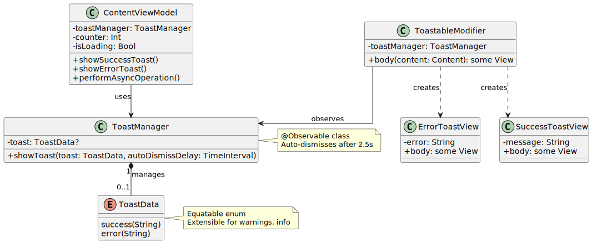
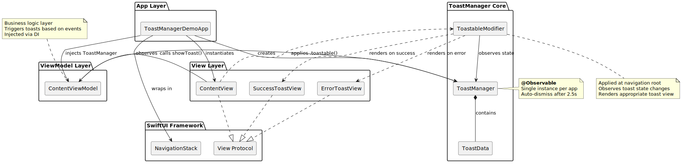
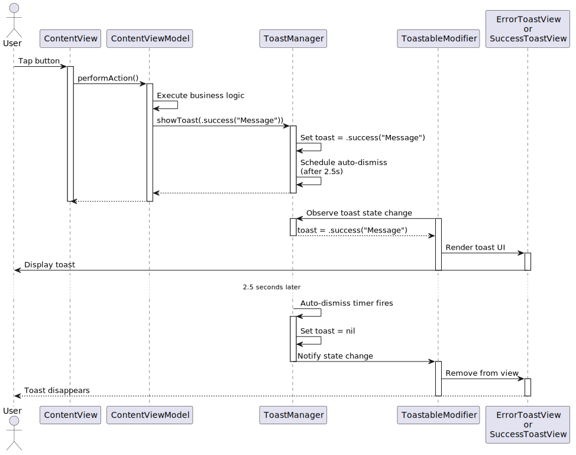

# ToastManager Usage Guide

## Overview

ToastManager is a lightweight SwiftUI component for displaying toast notifications. It consists of 3 core files:

| File | Purpose |
| --- | --- |
| `ToastManager.swift` | Observable class managing toast state and auto-dismiss |
| `ToastData.swift` | Enum defining toast types (success/error) |
| `ToastableModifier.swift` | ViewModifier rendering toasts |

**Demo Implementation**: This demo uses a simple SwiftUI overlay to avoid external dependencies and keep the example minimal.

**Production Recommendation**: For production apps, consider using a library like [PopupView](https://github.com/exyte/PopupView) to handle proper toast queuing, smoother animations, and edge cases like multiple simultaneous toasts.

## Core Components

### ToastData.swift

```swift
public enum ToastData: Equatable {
    case success(String)
    case error(String)
}
```

Simple enum representing toast types. Easily extensible for warnings, info, etc.

### ToastManager.swift

```swift
@Observable
open class ToastManager {
    var toast: ToastData?

    open func showToast(_ toast: ToastData, autoDismissDelay: TimeInterval = 2.5) {
        self.toast = toast

        DispatchQueue.main.asyncAfter(deadline: .now() + autoDismissDelay) { [weak self] in
            self?.toast = nil
        }
    }
}
```

**Key features:**
- `@Observable` macro for automatic SwiftUI observation
- `open class` allows subclassing for extended functionality
- Default 2.5s auto-dismiss (configurable per call)
- Thread-safe with weak self reference

### ToastableModifier.swift

```swift
public struct ToastableModifier: ViewModifier {
    @Bindable var toastManager: ToastManager

    public init(toastManager: ToastManager) {
        self._toastManager = Bindable(toastManager)
    }

    public func body(content: Content) -> some View {
        content
            .overlay(alignment: .bottom) {
                if let toast = toastManager.toast {
                    VStack {
                        Spacer()

                        switch toast {
                        case .error(let message):
                            ErrorToastView(error: message)

                        case .success(let message):
                            SuccessToastView(message: message)
                        }
                    }
                    .padding(.horizontal, 16)
                    .padding(.bottom, 16)
                    .transition(.move(edge: .bottom).combined(with: .opacity))
                    .animation(.spring(response: 0.3, dampingFraction: 0.8), value: toastManager.toast)
                }
            }
    }
}
```

This demo uses native SwiftUI `.overlay()` with spring animations. You must provide custom `ErrorToastView` and `SuccessToastView` matching your design system.

### Class Structure



## Architecture Pattern

### Core Principle

**ViewModels trigger toasts, not Views or App-level code.**

Business logic determines when to show toasts (API failures, validation errors, success confirmations). ViewModels own business logic, therefore they decide when toasts appear.

### Recommended Setup

**One ToastManager per app**: Create a single instance at the app level and inject it into ViewModels using your preferred dependency injection approach (constructor injection, environment objects, service locators, etc.).

### Architecture Overview



The diagram shows the complete component structure and relationships between App, View, ViewModel, and ToastManager layers.

### Data Flow

```
App/Scene creates ToastManager
       ↓
Root View applies .toastable(with:) modifier
       ↓
ToastManager injected to ViewModels via DI
       ↓
ViewModel calls showToast() based on business events
       ↓
ToastableModifier observes state change and renders toast
```

### Sequence Flow



The sequence diagram illustrates the complete lifecycle from user interaction through business logic execution, toast display, and automatic dismissal after 2.5 seconds.

## Implementation Guide

### Step 1: Create Toast Views

Implement custom views for your design system:

```swift
struct ErrorToastView: View {
    let error: String

    var body: some View {
        HStack(spacing: 12) {
            Image(systemName: "xmark.circle.fill")
                .font(.title2)
                .foregroundStyle(.white)

            Text(error)
                .font(.callout)
                .foregroundStyle(.white)

            Spacer(minLength: 0)
        }
        .padding(.horizontal, 16)
        .padding(.vertical, 12)
        .background(
            RoundedRectangle(cornerRadius: 12)
                .fill(Color.red.gradient)
        )
        .shadow(color: .black.opacity(0.1), radius: 8, x: 0, y: 4)
    }
}

struct SuccessToastView: View {
    let message: String

    var body: some View {
        HStack(spacing: 12) {
            Image(systemName: "checkmark.circle.fill")
                .font(.title2)
                .foregroundStyle(.white)

            Text(message)
                .font(.callout)
                .foregroundStyle(.white)

            Spacer(minLength: 0)
        }
        .padding(.horizontal, 16)
        .padding(.vertical, 12)
        .background(
            RoundedRectangle(cornerRadius: 12)
                .fill(Color.green.gradient)
        )
        .shadow(color: .black.opacity(0.1), radius: 8, x: 0, y: 4)
    }
}
```

### Step 2: Add View Extension

Create a convenience extension:

```swift
extension View {
    func toastable(with toastManager: ToastManager) -> some View {
        modifier(ToastableModifier(toastManager: toastManager))
    }
}
```

### Step 3: Setup in App

Create `ToastManager` at app level and apply modifier to root:

```swift
@main
struct MyApp: App {
    private let toastManager = ToastManager()

    var body: some Scene {
        WindowGroup {
            NavigationStack {
                ContentView(
                    viewModel: ContentViewModel(toastManager: toastManager)
                )
            }
            .toastable(with: toastManager)
        }
    }
}
```

### Step 4: Inject into ViewModels

Inject `ToastManager` using your preferred dependency injection approach. This example uses constructor injection:

```swift
@MainActor
final class ContentViewModel: ObservableObject {
    private let toastManager: ToastManager

    @Published var counter: Int = 0

    init(toastManager: ToastManager) {
        self.toastManager = toastManager
    }

    func performAction() {
        // Business logic here
        toastManager.showToast(.success("Action completed"))
    }
}
```

**Alternative DI approaches:**
- Environment objects: `@EnvironmentObject var toastManager: ToastManager`
- Service locator pattern
- Third-party DI frameworks (Swinject, Factory, etc.)

### Step 5: Trigger Toasts from Business Logic

```swift
// Simple success
func saveData() {
    // ... save logic ...
    toastManager.showToast(.success("Data saved successfully"))
}

// Error handling
func loadData() async {
    do {
        let data = try await repository.fetchData()
        self.items = data
    } catch {
        toastManager.showToast(.error(error.localizedDescription))
    }
}

// Custom duration
func showImportantMessage() {
    toastManager.showToast(
        .error("Connection lost. Retrying..."),
        autoDismissDelay: 5.0
    )
}

// Async operation with feedback
func performAsyncTask() async {
    isLoading = true

    do {
        try await Task.sleep(for: .seconds(2))
        counter += 1
        toastManager.showToast(.success("Counter: \(counter)"))
    } catch {
        toastManager.showToast(.error("Operation failed"))
    }

    isLoading = false
}
```

## Advanced Usage

### Extending ToastManager

For apps requiring additional UI feedback beyond toasts, subclass `ToastManager`:

```swift
@MainActor
final class AppToastManager: ToastManager {
    @Published var errorDialogConfig: ErrorConfig?

    func showError(
        message: String,
        onRetry: @escaping () -> Void,
        onCancel: @escaping () -> Void
    ) {
        errorDialogConfig = ErrorConfig(
            message: message,
            onRetry: onRetry,
            onCancel: onCancel
        )
    }
}

struct ErrorConfig: Identifiable {
    let id = UUID()
    let message: String
    let onRetry: () -> Void
    let onCancel: () -> Void
}
```

Update the modifier to handle extended states:

```swift
.sheet(item: $toastManager.errorDialogConfig) { config in
    ErrorDialog(config: config)
}
```

### Loading Overlay Manager

For blocking loading overlays, consider creating a separate `LoadingManager` using a similar pattern:

```swift
@Observable
final class LoadingManager {
    var isLoading = false

    func showLoading() {
        isLoading = true
    }

    func hideLoading() {
        isLoading = false
    }
}

struct LoadableModifier: ViewModifier {
    @Bindable var loadingManager: LoadingManager

    func body(content: Content) -> some View {
        content
            .overlay {
                if loadingManager.isLoading {
                    LoadingOverlay()
                }
            }
    }
}
```

This separates concerns: ToastManager for non-blocking notifications, LoadingManager for blocking operations.

### Adding Toast Types

Extend `ToastData` enum:

```swift
public enum ToastData: Equatable {
    case success(String)
    case error(String)
    case warning(String)
    case info(String)
}
```

Update `ToastableModifier` switch statement:

```swift
switch toast {
case .success(let message):
    SuccessToastView(message: message)
case .error(let message):
    ErrorToastView(error: message)
case .warning(let message):
    WarningToastView(message: message)
case .info(let message):
    InfoToastView(message: message)
}
```

### Testing ViewModels with Toasts

Mock `ToastManager` for unit tests:

```swift
final class MockToastManager: ToastManager {
    var lastToast: ToastData?
    var showToastCallCount = 0

    override func showToast(_ toast: ToastData, autoDismissDelay: TimeInterval = 2.5) {
        lastToast = toast
        showToastCallCount += 1
    }
}

// In tests
func testErrorHandling() async {
    let mockToast = MockToastManager()
    let viewModel = ContentViewModel(toastManager: mockToast)

    await viewModel.performFailingOperation()

    XCTAssertEqual(mockToast.showToastCallCount, 1)
    XCTAssertEqual(mockToast.lastToast, .error("Operation failed"))
}
```

## Responsibility Summary

| Component | Responsibility |
| --- | --- |
| **App/Scene** | Creates `ToastManager`, applies `.toastable()` modifier at root |
| **ViewModel** | Receives `ToastManager` via DI, calls `showToast()` for business events |
| **View** | Displays UI, passes user actions to ViewModel (no toast logic) |
| **ToastableModifier** | Observes `ToastManager` state, renders toasts automatically |

## Best Practices

1. **Single ToastManager per app**: One instance shared across the entire application
2. **Apply modifier at root**: Ensure `.toastable()` is on the outermost container so toasts appear above all content
3. **Keep toasts short**: Aim for 1-2 line messages (long messages can use dialogs instead)
4. **Use meaningful messages**: "Data loaded" is better than "Success"
5. **Handle edge cases**: Don't show toasts if user navigates away during async operations
6. **Test toast triggers**: Verify ViewModels call `showToast()` in expected scenarios
7. **Consistent visual design**: Use your app's color scheme and typography
8. **Consider PopupView for production**: Use [PopupView](https://github.com/exyte/PopupView) for better toast queuing and animations

## Common Patterns

### Network Request with Toast

```swift
func fetchUserData() {
    Task {
        isLoading = true

        defer { isLoading = false }

        do {
            self.user = try await api.getUser()
            toastManager.showToast(.success("Profile loaded"))
        } catch {
            toastManager.showToast(.error("Failed to load profile"))
        }
    }
}
```

### Form Validation

```swift
func submitForm() {
    guard validate() else {
        toastManager.showToast(.error("Please fill all required fields"))
        return
    }

    // Submit logic
    toastManager.showToast(.success("Form submitted"))
}
```

### Background Task Completion

```swift
func startBackgroundSync() {
    Task {
        try? await syncService.sync()
        toastManager.showToast(.success("Sync completed"))
    }
}
```

## Migration from Other Toast Libraries

If migrating from other toast solutions:

1. Replace library toast calls with `toastManager.showToast()`
2. Move toast triggers from Views to ViewModels
3. Remove toast-specific view state (e.g., `@State var showToast = false`)
4. Apply `.toastable()` modifier once at root level
5. Remove individual toast modifiers from child views
6. Setup DI to inject `ToastManager` into ViewModels

## Implementation Checklist

- [ ] Copy 3 core files to project (ToastData, ToastManager, ToastableModifier)
- [ ] Create ErrorToastView and SuccessToastView matching your design
- [ ] Add View extension with `.toastable()` method
- [ ] Create ToastManager instance at app level
- [ ] Apply `.toastable()` modifier to root view
- [ ] Setup DI to inject ToastManager into ViewModels
- [ ] Replace existing toast calls with `toastManager.showToast()`
- [ ] Write tests using MockToastManager
- [ ] (Optional) Integrate PopupView for production-grade animations

## Demo Project

Full working implementation available in this repository with examples in `ContentView` and `ContentViewModel`.
